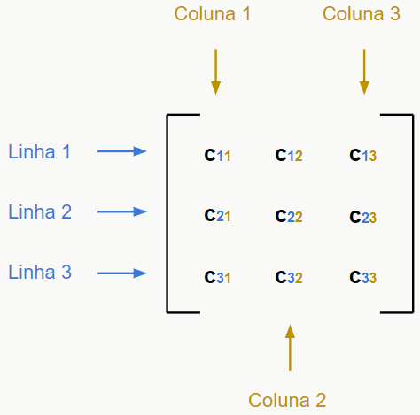
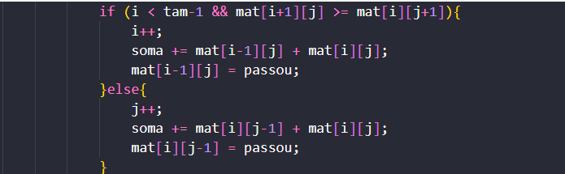
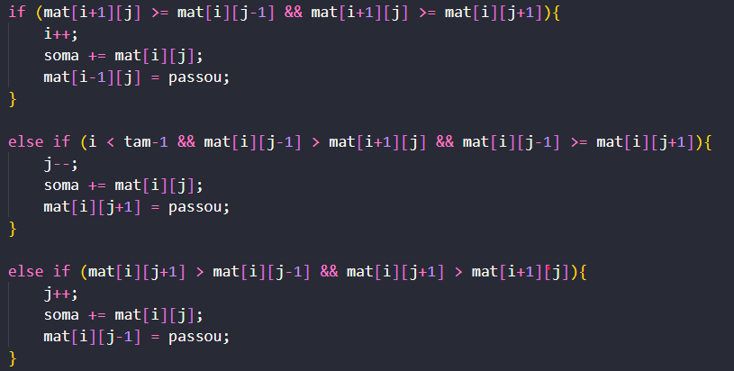
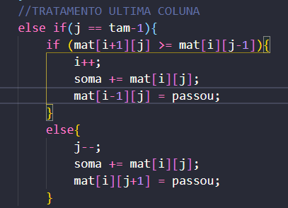
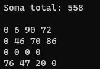

# <h1>Exercício 1</h1>
---
<h1>Introdução</h1>

Uma matriz é uma estrutura do tipo vector organizada por linhas e colunas, no formato i x j, onde o primeiro elemento se encontra no canto superior esquerdo (mat[ 0 ] [ 0 ]) e o último elemento no canto inferior direito (mat[ i ][ j ]). No exercício solicitado, é trabalhado com a forma quadrática da matriz, onde o número de linhas e colunas são exatamente iguais (i = j).

 

<h1>Lógica do programa</h1>
<h2>Desenvolvendo a matriz</h2>

Para a construção da matriz, o programa pergunta ao usuário o tamanho da matriz desejada e aloca dinamicamente este inteiro em uma matriz. Após isso utiliza a função <code>preencheEImprimeMatriz()</code>, que, preenche a matriz com números inteiros aleatórios de 0 a 99 usando a função C <code>'rand()'</code>.

 
<h2>Percorrendo a matriz</h2>

Então, o algoritmo se desenvolve procurando o maior caminho possível seguindo o seguinte padrão: começa-se no primeiro elemento, compara-se então, os próximos elementos — neste caso o da direita e abaixo, visto que não existem elementos na esquerda —, o que mostrar o maior número inteiro, deverá ser o próximo passo na matriz.

 

Na literatura, pode-se encontrar o algortimo guloso, que possui o objetivo de encontrar seu caminho tomando decisões imediatas na posição em que se encontra, sem analisar possíveis melhores ou piores caminhos, sendo assim um algoritmo míope[1].
Para fazer a comparação o programa utiliza blocos de 'ifs', dentro de um loop(enquanto linha != fim && coluna && fim), com condições que comparam os próximos elementos. Dentro destes há o incremento na posição resultante da comparação(1),a soma do elemento anterior e do atual(2) e a exclusão do elemento anterior.

 

Porém, há específicas ocasiões que o programa encontra obstáculos para achar seu próximo passo, por exemplo, quando está em uma borda ele só poderá se mover para uma específica posição:

Com isso, ao chegar na posição final, o programa irá imprimir uma nova matriz que mostrará os passos que o programa percorreu, além da soma final dos mesmos:

<h1>Perguntas</h1>
1- Uma maneira de chegar ao mesmo resultado é fazendo o caminho inverso, apontando como posição inicial mat[n][n] e invertendo a polaridade das condições dos <code>ifs</code> iniciais, como por exemplo o (j == 0) seria agora (j==n-1) e o (i == 0) seria (i == n-1), tratando assim os travamentos nas últimas colunas e linhas, respectivamente.
 
2- Em literatura, pode-se observar o Algoritmo de Dijkstra, que calcula o menor caminho utilizando como método o algoritmo guloso, supracitado em [1].
 
3- Sim, se a matriz apresentar números repetidos, o algoritmo pode alcançar o valor máximo por outros caminhos.
